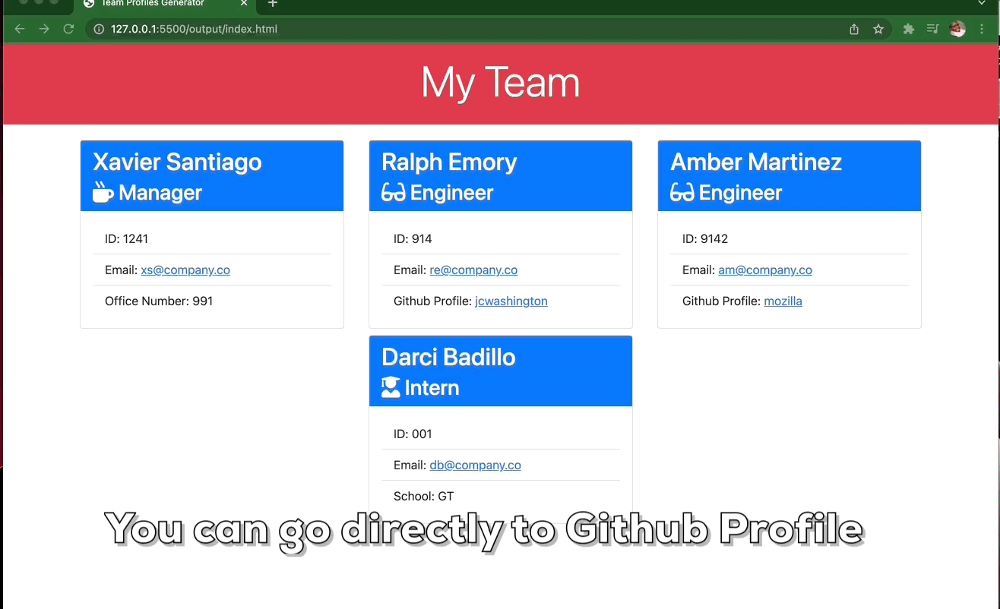
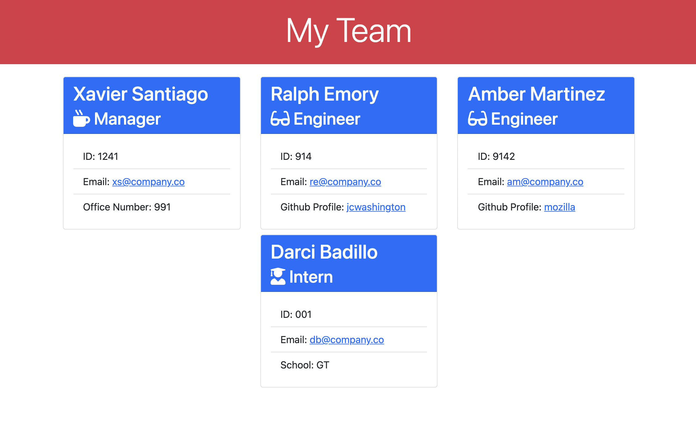

  # Team Profiles Generator

  [](http://opensource.org/licenses/ISC)

  ## Description
  This is a simple to use Node.js command-line application that takes in information about employees on a software engineering team, then generates an HTML webpage that displays summaries for each person. This is the user story:

  ```md
  AS A manager
  I WANT to generate a webpage that displays my team's basic info
  SO THAT I have quick access to their emails and GitHub profiles
  ```

  Technologies Utilized:
  Node, Javascript, HTML, Bootstrap 5, npm Inquirer and Jest packages.

  Challenges and Future Developement Opportunities:
  There were a lot of moving parts that led to a few hiccups. There are some things I'd like to improve, such as better handling of the sequence in which the user enters information.

  ## Contents

  1. [Installation](#installation)
  2. [Project Usage](#usage)
      1. [Visuals](#visuals)
  3. [Licenses](#licenses)
  4. [Testing](#testing)
  5. [How to contribute](#contributing)
  6. [Project Credits](#credits)
      1. Authors
      2. Additional Acknowledgements
  7. [Have Questions?](#questions)

  ## [Installation](#installation)
  To clone repo: 
  ```md
  git clone git@github.com:jcwashington/Team_Profiles_Generator.git
  ```
  Run npm install to install necessary dependencies. 
  Run 'node index.js' to run the generator. 
  When finished, access the generated html file in the ./output directory.

  ## [Project Usage](#usage)
  Using this generator is as easy as starting the program by typing 'node index.js' into your terminal.
  The first team member that must be added is the manager, after that you can begin to choose if you'd like to add additional Engineers or Interns to the team.

  ### [Visuals](#visuals)
  Here you can view a full walkthrough video of how to use the CLI tool: [Team Profile Generator v1.0](https://drive.google.com/file/d/1VAPfJ7YwEMkoGuez7LNCenbjsoK22L_a/view?usp=sharing)

  Also worth adding is how easy it is to view the team member's Github profile and/or send an email directly to them
  

  The UI is very simple and would also be very easy to customize to the manager's or company's preferences
  

  ## [Licenses](#licenses)
  This project uses the ISC license.

  To find out more information on open source licenses, please refer to [https://choosealicense.com/](https://choosealicense.com/).

  ## [Testing](#testing)
  npm run test

  ## [How to contribute](#contributing)
  If you would like to contribute to this project, follow the steps below.
  1. Fork the repo on GitHub.
  2. Clone the project to your own machine.
  3. Create a branch for your feature work.
  3. Commit changes to your own branch.
  4. Push your work back up to your fork.
  5. Submit a Pull request so that we can review your changes

  ## [Project Credits](#credits)

  Project Authors:

  [jcwashington](https://github.com/jcwashington)
  

  ## [Have Questions?](#questions)
  Contact the author with your questions:
    *GitHub Username: jcwashington
    *GitHub Email: jasmine.washington412@gmail.com
